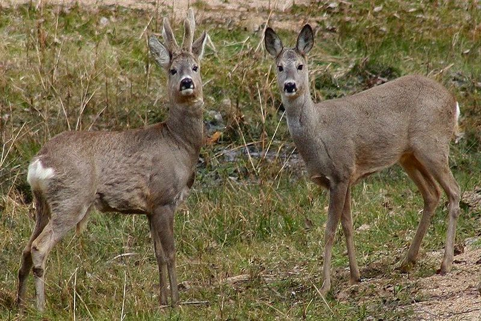
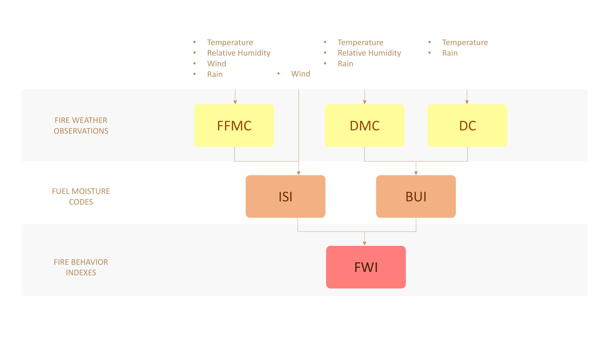
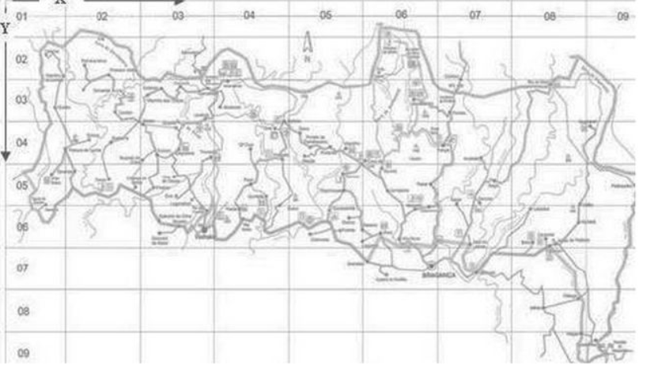
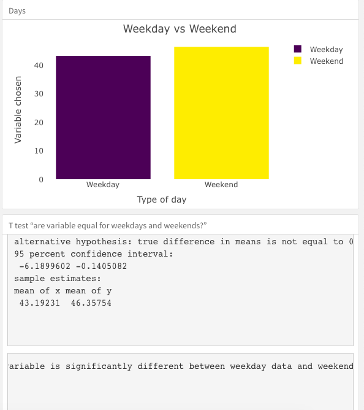

```{r setup, include = FALSE}
library(tidyverse)
library(dplyr)
library(ggplot2)
library(patchwork)
library(plotly)
library(png)

knitr::opts_chunk$set(
  fig.width = 6,
  fig.asp = .6,
  out.width = "90%"
)

options(
  ggplot2.continuous.colour = "viridis",
  ggplot2.continuous.fill = "viridis"
)

scale_colour_discrete = scale_color_viridis_d
scale_fill_discrete = scale_fill_viridis_d
```
<br>

## Motivation

Two major wildfire disasters occurred recently: Australia BushFire, and California CampFire. The severe consequences of wildfires on the environment and health catches our attention. We might not have the ability to avoid wildfire, however, we are able to understand more about it, and maybe find a better way to minimize the losses in future. Therefore, this study will be conducted to see the potential factors of wildfire, in order to have some insight into wildfire. Since there are plenty of studies focusing on wildfire in the US and Australia, we decided to start our project in a new place to us, Portugal. In the project, we will compare the weather and climate conditions of The Montesinho Natural Park, one of the largest natural parks in Portugal.

***

## Related work

Our study is mainly inspired by the following idea, articles, and website:

* From [Wildfires and Climate Change](https://www.c2es.org/content/wildfires-and-climate-change/), we know that wildfire risk strongly depends on a number of weather factors, including temperature, wind, rain, soil moisture, and the presence of other potential fuel, etc. Thus, it gave us the hint of where we can start when conducting the analysis.


* [US Wildfire Map](https://www.esri.com/en-us/disaster-response/disasters/wildfires) is an interactive real-time wildfire map for the United States. It displays current wildfire locations as reported by responding agencies and other sources of information related to wildfires.


***

## Background Information

<br>

### The Montesinho Natural Park

[The Montesinho Natural Park](https://www.montesinho.com/en) is a protected area located in the northeastern Portugal. It is one of the largest natural parks in Portugal.

The geological diversity of this space and variations in soil characteristics and climate, originate a highly varied plant life, and an ideal habitat for animals.Its biodiversity includes the [Iberian wolf](https://en.wikipedia.org/wiki/Iberian_wolf), [roe deer](https://en.wikipedia.org/wiki/Roe_deer), [wild boar](https://en.wikipedia.org/wiki/Wild_boar), [Iberian lynx](https://en.wikipedia.org/wiki/Iberian_lynx), [common genet](https://en.wikipedia.org/wiki/Common_genet), [red fox](https://en.wikipedia.org/wiki/Red_fox), [European otter](https://en.wikipedia.org/wiki/Eurasian_otter), and around 240 other animal species.

      


<br><br>

### Forest Fire Weather Index (FWI) System

The Forest Fire Weather Index (FWI) System is an estimation of risk of wildfire. It includes six components: FFMC, DMC, DC, ISI, BUI, FWI.

The first three components are fuel moisture codes. The three values rise as the moisture content decreases.

The remaining three components are fire behavior indexes. The three values rise as the fire danger increases.

The figure below illustrates the six components of the FWI System.



* **Fine Fuel Moisture Code (FFMC)**

  The Fine Fuel Moisture Code (FFMC) is a numeric rating of the moisture content of litter and other cured fine fuels. This code is an indicator of the relative ease of ignition and the flammability of fine fuel.
  

* **Duff Moisture Code (DMC)**

  The Duff Moisture Code (DMC) is a numeric rating of the average moisture content of loosely compacted organic layers of moderate depth. It gives an indication of fuel consumption in moderate duff layers and medium-size woody material.
  

* **Drought Code (DC)**

  The Drought Code (DC) is a numeric rating of the average moisture content of deep, compact organic layers. It is a useful indicator of seasonal drought effects on forest fuels and the amount of smoldering in deep duff layers and large logs.
  

* **Initial Spread Index (ISI)**

  The Initial Spread Index (ISI) is a numeric rating of the expected rate of fire spread. It is based on wind speed and FFMC. Like the rest of the FWI system components, ISI does not take fuel type into account. Actual spread rates vary between fuel types at the same ISI.
  

* **Buildup Index (BUI)**  *(Not included in this project)*

  The Buildup Index (BUI) is a numeric rating of the total amount of fuel available for combustion. It is based on the DMC and the DC. The BUI is generally less than twice the DMC value, and moisture in the DMC layer is expected to help prevent burning in material deeper down in the available fuel.
  

* **Fire Weather Index (FWI)**

  The Fire Weather Index (FWI) is a numeric rating of fire intensity. It is based on the ISI and the BUI, and is used as a general index of fire danger throughout the forested areas of Canada.


***

## Initial Questions
These are the questions we have at the very beginning of our project. They can be concluded in three dimensions:

***Overview***

* How is the forest fire distributed in the park?

* Where in the park has the most severe fire?

* How large can the forest fire be?


***Data Analysis*** 

* Which of the climate variables have significant effect on wild fires?

* How are these variables related to the burned area of forest fire?


***Suggestion*** 

* For general tourists, what suggestions can we provide from the data? 

* For fire departments, what suggestions can we provide from the data?


***

## Data
<br>

#### ***Sources***

[Paulo Cortez Home Page](http://www3.dsi.uminho.pt/pcortez/Home.html)

<br>

#### ***Data Set Information***

The fire data concerns burned areas of the forests in Montesinho Natural park due to forest fires from 2000 January to 2003 December. The data cuts the Natural Park into small grid areas with fixed x and y, corresponding to the park map below. In addition, the variable 'area' was transformed with a ln(x+1) function.


<br>

#### ***Variables of interest***

For more information, read [Cortez and Morais, 2007].

* **X** - x-axis spatial coordinate within the Montesinho park map: 1 to 9
* **Y** - y-axis spatial coordinate within the Montesinho park map: 2 to 9
* **month** - month of the year: 'jan' to 'dec'
* **day** - day of the week: 'mon' to 'sun'
* **FFMC** - FFMC index from the FWI system: 18.7 to 96.20
* **DMC** - DMC index from the FWI system: 1.1 to 291.3
* **DC** - DC index from the FWI system: 7.9 to 860.6
* **ISI** - ISI index from the FWI system: 0.0 to 56.10
* **temp** - temperature in Celsius degrees: 2.2 to 33.30
* **RH** - relative humidity in %: 15.0 to 100
* **wind** - wind speed in km/h: 0.40 to 9.40
* **rain** - outside rain in mm/m2 : 0.0 to 6.4
* **area** - the burned area of the forest (in ha): 0.00 to 1090.84
(this output variable is very skewed towards 0.0, thus it may make
sense to model with the logarithm transform)

(For more information about the data, read [Fire Weather Index (FWI) System](https://www.nwcg.gov/publications/pms437/cffdrs/fire-weather-index-system).)

<br>

#### ***Relevant Papers***

[Cortez and Morais, 2007](http://www3.dsi.uminho.pt/pcortez/fires.pdf) P. Cortez and A. Morais. A Data Mining Approach to Predict Forest Fires using Meteorological Data. In J. Neves, M. F. Santos and J. Machado Eds., New Trends in Artificial Intelligence, Proceedings of the 13th EPIA 2007 - Portuguese Conference on Artificial Intelligence, December, Guimarães, Portugal, pp. 512-523, 2007. APPIA, ISBN-13 978-989-95618-0-9.

***

## Exploratory Analysis
<br>

In `Overview`, we can find `Descriptive Statistics`, `Geography`, and `Fire Count`. Each part guide the users to gain a deeper understanding of what we have done with the dataset.


* [Descriptive Statistics](https://caution6.shinyapps.io/statistic/) provides the user an interactive way to learn about conditions within each grid on the map. The user could interact with three drop-down menus at the sidebar. The first drop-down menu named “FWI Variables” enables the user to select interested variables. Obviously, the other two drop-down menus “X-axis Coordinate” and “Y-axis Coordinate” let users specify the grid they want easily. After selecting three drop-down menus, the user could observe the plot and map. The plot will show values for interested variables along the month. The map will show the specified grid by painting that grid yellow. 
When tidying data for the plot, my first step was removing variables `day` and `area` from the crude data frame. They are not relevant to my plot. Then, I grouped data by variables `X`, `Y`, and `month` to compute the mean or sum for each raw variable. The third step was removing raw variables and keeping one row for each group. Because not every possible group was included in our data, I merged the full list of possible groups into the  data frame. At the same time, I set the order for the variable `month`. Because merged data has `NA` that disrupts plot function, I changed all `NA` into `0`. I also changed the data frame into a longer version for the filter function. Finally, I change the name of variables from abbreviation to words. 
I changed the code of the plot significantly twice. Originally, some months did not appear in plots. There is no data in that month within that grid. As a result, I merged the full list of possible groups into the  data frame. Then, I found months appearing in plots without order. To solve this, I set the order for the variable `month`. 
When tidying data for the map, my first step was creating the full list of possible grids. Then, I filtered the data frame by input of `X-axis Coordinate` and input of `Y-axis Coordinate`. To distinguish this row, I created a new variable `area`, which equals one. I merged the filtered row into the full list of possible grids and changed all `NA` into `0`. At the same time, I import the map picture. To fit grids in the map, I changed all `Y` values into negative values. 
I changed the code of the map significantly twice. Originally, I tried to use the image function to plot the grid. However, I had no idea about how to overlay pictures by the image function. I changed my code and tried to use the plotly function. Unfortunately, I still did not find the way. Finally, I tried the ggplot function. 


* [Geography](https://tracici25.github.io/charmander-project.github.io/geography.html) mainly show the heatplot to the user. Heatmap visualizes variable `total` in the corresponding grid by color. Transparent means `NA` or `0`. Red represents the upper limit of variable `total`.
The tidy process for geography is quite similar to the process of descriptive statistics. When tidying data for the heatmap, my first step was removing all other variables other than variables `X`, `Y`, and `area` from the crude data frame. They are not relevant to my plot. Then, I grouped data by variables `X` and `Y` to compute the sum for the variable `area`. The third step was removing the variable `area` and keeping one row for each group. Because not every possible group was included in our data, I merged the full list of possible groups into the  data frame. To fit grids in the map, I changed all `Y` values into negative values. Because merged data has `NA` that disrupts plot function, I changed all `NA` into `0`. At the same time, I import the map picture. 


* [Fire Count](https://tracici25.github.io/charmander-project.github.io/barchart.html) give users a whole picture of the total number of wildfires and the numbers of collected data in each month among 2000 to 2003. When cleaning the data, we firstly converted “Month” as a factor, which is also used in the following part of `Observation by Time`. Then we create two data frame, one with all the collected observations, and the other with only the counts of wildfire for each month. Lastly, we combined two bar charts into one, in order to let users to compare the difference between the sample size of each month and the actual number of wildfire in each month.


<br>

***

## Additional Analysis
<br>

In `Data Analysis`, we can find `Observation by Time`, `Fire vs. No Fire`, and `Linear Regression`. Each part also guide the users to gain a deeper understanding of the wildfire in The Montesinho Natural Park.

* [Observation by Time](https://yuechen-liu.shinyapps.io/time/) is an interactive dashboard that allows users to examine the patterns of wildfires by choosing certain parameters of The Montesinho Natural Park. Users can get the picture of the parameters from two aspects: by monthly, or by the types of day (weekday vs weekends). The left graph depicts the relationship between every parameter and every month. The right one depicts the relationship between every parameter and type of day. 
When cleaning the data, we firstly converted “Month” as a factor which is mentioned above. Then we excluded the coordinate data, calculated means of every parameter, and pivoted them into a long column.
For the dataset created for the “type of day” plot, we filtered the day to two categories: weekdays and weekends. In order to do the t-test, we chose not to calculate the mean.
  For this plot “Weekday vs. Weekend”, we did two-sided t-tests for all parameters as stated. From all these p-values, we can see that only the relative humidity was tested to have significant difference between weekdays and weekends. 
  
  ***Hypothesis***:
  
    *H0: This variable is the same for weekdays and weekends.*
    
    *H1: This variable has significant differences for weekdays and weekends.*
    
    
    
  In related papers, we read that researchers were interested in whether type of day will affect the wildfire. However, in this part, we found that most parameters remain the same no matter what kind of day it is. 


* [Fire vs. No Fire](https://tracici25.shinyapps.io/boxplot/) allow us to study the differences in each climate variable on fire days and no fire days, a shiny app was designed. Users are able to select the climate variable of interest, and explore the numeric statistics by viewing the boxplots. By comparing the means, medians, IQRs of two categories, one can observe how the numerical values of two groups differ. The density plots on the top right show the distribution of the variable on fire days and no fire days, so that the variance/standard deviation can be virtualized. Lastly, two-sample t-test is conducted with null hypothesis of: 
equation.
Screenshot
After conducting t tests for all climate variables, it is shown that only the DC index has a p-value less than the significance level of 0.05, indicating that the null hypothesis is rejected and concluding that the DC index has a significant difference between fire days and no fire days. All other climate variables have a p-value greater than 0.05, indicating that the null hypothesis is failed to be rejected and concluding that the variables have no significant difference between fire days and no fire days.


* As for [Linear Regression](https://tracici25.github.io/charmander-project.github.io/linear.html), we fit a multiple linear regression model for burned area vs. all other parameters. 

  Insert a MLR summary here

  From the MLR summary, all p-values are insignificant and they could be confounding or correlated, indicating a model with all climate variables might not be an appropriate model. Therefore, we decided to do a backward elimination to locate the possible predictors for linear regression to find the best possible model to fit our outcome of interest. We started with a complete linear model with all predicting variables, and removed the predictor with the highest p-value(for which is greater than the threshold of 0.2). Then we refit the model and removed the next least significant predictor. We repeated the steps until all p-values are smaller than 0.2.
After the backward elimination, only two parameters, DMC and RH were still in the model. Now we can get the regression equation: 

  Insert the equation here: BurnedArea=36.7582234+0.1289139DMC−0.6161311RH
 


  To examine the feasibility and accuracy of our model, we also made a violin plot of residuals. The residuals do not show a normal distribution, which indicates that the linear model utilized is not accurate and not appropriate for this dataset.


***

## Discussion

Unfortunately, after all the teamwork and discussions, we were not able to answer all the questions we initially listed at last. Although we have a perfect dataset, which is clean and tidy, the location that we have chosen are too specific and fixed to get abundant information. For instance, since the dataset cut the whole park into small grids with fixed x and y, we can only do analysis for the strict grid areas. Or, we were not able to distinguish which year is the data for. This limits us from doing further analysis. Thankfully, we still have many insights from all the work we have done.


* In `Geography`, we can find the answers to the following questions:
  
  ` 1. How is the forest fire distributed in the park? `
  
  The forest fire is distributed nearly as a diagonal line, from the northwestern to the southeastern of the park. Most areas do not have fire or only have mild fire. The western side has less severe fire conditions than the east side.


  ` 2. Where in the park has the most severe fire? `

  The areas that have the most severe fire are located in the east direction of the park. Their coordinates are (6,5) and (8,6).


* In `Data Analysis`, we have some interesting findings below: 

  ` 1. Which of the climate variables have a significant effect on wildfires? `

  Based on the results generated by sample t tests, DC index is the only variable which mean values are significantly different on fire days and no fire days. It is interesting to see that the level of drought deep into the soil (DC index) varies, but other FWI system indexes do not. 


  ` 2. How are these variables related to the burned area of forest fire? `

  After fitting a multiple linear regression model to the data, the variables associated with the burned area are DMC index and relative humidity, that DMC has a positive association with the outcome while relative humidity has a negative association. It is worth noting that the DMC index represents the fuel moisture of decomposed organic material underneath the litter, which has an opposite coefficient to relative humidity. However, MLR diagnostics results show a non-normalized residual distribution, inferring an inappropriate model fit to the dataset. More literature search needs to be conducted. 


***


