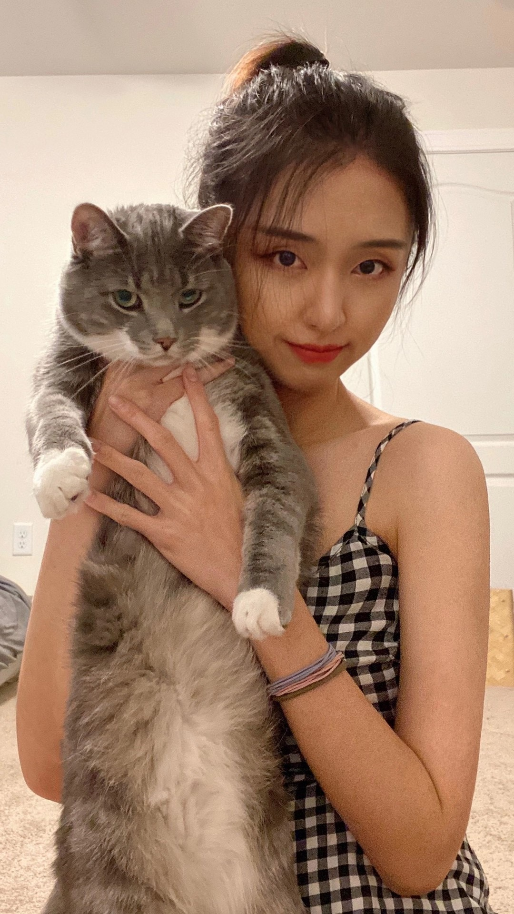

   

### Team Members

***

#### **Angeline Chen**

* *[Personal Web](https://meijuchen.github.io/mc4959_new.github.io/)*
* *[Email](mailto:<mc4959@cumc.columbia.edu>)*
* *[Linkedin](https://www.linkedin.com/in/mei-ju-chen-738b931ba/)*
* *[Github](http://github.com/meijuchen/)*

***

#### **Yanhao Li**

* *[Personal Web](https://caution6.github.io/)*
* *[Email](mailto:<yl4612@cumc.columbia.edu>)*
* *[Github](https://github.com/Caution6)*

***

#### **Yuechen Liu**

* *[Personal Web](https://yuechen-liu.github.io/)*
* *[Email](mailto:<yl4613@cumc.columbia.edu>)*
* *[Linkedin](https://www.linkedin.com/in/yuechen-liu-037a231b9/)*
* *[Github](https://github.com/Yuechen-Liu)*

***

#### **Mufeng Xu**

* *[Personal Web](https://tracici25.github.io/)*
* *[Email](mailto:<mx2241@cumc.columbia.edu>)*
* *[Linkedin](https://www.linkedin.com/in/mufeng-xu-a1388bb5/)*
* *[Github](http://github.com/tracici25/)*

***
